## 📋 高层摘要（TL;DR）

**影响范围：** 🔴 **高** - 本次变更对系统架构进行了重大重构，从单一用户系统升级为三角色系统（用户/医生/管理员）

**核心变更：**
- ✨ 新增三角色身份系统（用户、医生、管理员）及权限控制机制
- 🔐 新增管理员硬编码登录（admin/admin）及管理后台
- 👨‍⚕️ 新增医生注册邀请码机制及医生管理功能
- 🛡️ 新增身份验证工具函数，实现页面级权限控制
- 📊 优化健康评分算法，新增体检报告统计功能
- 🎨 更新应用名称为"健康小助手"，优化登录注册UI

---

## 🗺️ 系统架构与逻辑图

```mermaid
graph TD
    subgraph "登录流程"
        A[用户访问登录页] --> B{选择身份}
        B -->|用户| C[用户登录]
        B -->|医生| D[医生登录]
        B -->|管理员| E[管理员登录]
        
        C --> F[accountLogin云函数]
        D --> F
        E --> F
        
        F --> G{验证账号密码}
        G -->|管理员| H[硬编码验证]
        G -->|其他| I[数据库验证]
        
        H --> J[跳转管理员首页]
        I --> K{身份匹配?}
        K -->|是| L[跳转对应首页]
        K -->|否| M[返回错误]
    end
    
    subgraph "注册流程"
        N[用户访问注册页] --> O{选择身份}
        O -->|用户| P[用户注册]
        O -->|医生| Q[医生注册]
        
        Q --> R[输入邀请码]
        R --> S[register云函数]
        S --> T{验证邀请码}
        T -->|有效| U[创建医生账号]
        T -->|无效| V[返回错误]
        
        P --> W[register云函数]
        W --> X[创建用户账号]
    end
    
    subgraph "权限控制 utils/security.js"
        Y[getUserIdentity] --> Z{判断身份}
        Z -->|doctor| AA[ensureDoctor]
        Z -->|admin| AB[ensureAdmin]
        Z -->|user| AC[ensureUser]
        
        AA --> AD[允许访问医生页面]
        AB --> AE[允许访问管理员页面]
        AC --> AF[允许访问用户页面]
        
        AA -.-> AG[重定向到登录页]
        AB -.-> AG
        AC -.-> AG
    end
    
    subgraph "数据管理"
        AH[管理员] --> AI[生成邀请码]
        AI --> AJ[doctor_invites集合]
        
        AH --> AK[添加医生]
        AK --> AL[users集合]
        
        AH --> AM[绑定用户]
        AM --> AN[user_profiles集合]
        
        AH --> AO[清除所有数据]
        AO --> AP[所有集合清空]
    end
    
    style A fill:#e3f2fd,color:#0d47a1
    style H fill:#ffebee,color:#b71c1c
    style J fill:#ffebee,color:#b71c1c
    style AH fill:#ffebee,color:#b71c1c
    style D fill:#fff3e0,color:#e65100
    style Q fill:#fff3e0,color:#e65100
    style C fill:#c8e6c9,color:#1b5e20
    style P fill:#c8e6c9,color:#1b5e20
```



---

## 📝 详细变更分析

### 1️⃣ 身份系统重构

#### **核心变更**
- **原有系统：** 单一用户角色
- **新系统：** 三角色架构（用户 `user`、医生 `doctor`、管理员 `admin`）

#### **数据结构变更**

| 字段 | 类型 | 说明 | 来源 |
|------|------|------|------|
| `identity` | String | 用户身份标识（user/doctor/admin） | `users` 集合 |
| `inviteCode` | String | 医生注册邀请码 | `doctor_invites` 集合 |
| `doctorId` | String | 绑定的医生ID | `user_profiles` 集合 |
| `doctorInfo` | Object | 医生详细信息 | `user_profiles` 集合 |

#### **登录流程变更**
**文件：** `pages/login/login.js`, `cloudfunctions/accountLogin/index.js`

```javascript
// 新增身份参数
const { account, password, identity } = event;

// 管理员硬编码验证
if (account === 'admin' && password === 'admin') {
  if (identity !== 'admin') {
    return { code: -1, message: '管理员身份不匹配' };
  }
  return {
    code: 0,
    data: { _id: 'admin', account: 'admin', nickName: '管理员', identity: 'admin' }
  };
}

// 数据库查询增加身份过滤
const result = await db.collection('users').where({ account, identity }).get();
```

#### **注册流程变更**
**文件：** `pages/register/register.js`, `cloudfunctions/register/index.js`

```javascript
// 医生注册必须提供邀请码
if (identity === 'doctor') {
  if (!inviteCode) {
    return { code: -1, message: '医生注册需要邀请码' };
  }
  
  // 验证邀请码
  const inviteResult = await db.collection('doctor_invites')
    .where({ code: inviteCode, used: false })
    .get();
  
  if (inviteResult.data.length === 0) {
    return { code: -1, message: '邀请码无效或已使用' };
  }
  
  // 标记邀请码为已使用
  await db.collection('doctor_invites')
    .doc(invite._id)
    .update({ data: { used: true, usedBy: account, usedAt: db.serverDate() } });
}
```

---

### 2️⃣ 权限控制机制

#### **新增工具函数**
**文件：** `utils/security.js`

| 函数名 | 功能 | 返回值 |
|--------|------|--------|
| `getUserIdentity()` | 获取当前用户身份 | 'user'/'doctor'/'admin'/null |
| `checkDoctorIdentity()` | 检查是否为医生 | Boolean |
| `checkAdminIdentity()` | 检查是否为管理员 | Boolean |
| `checkUserIdentity()` | 检查是否为普通用户 | Boolean |
| `ensureDoctor()` | 确保医生身份，否则重定向 | Boolean |
| `ensureAdmin()` | 确保管理员身份，否则重定向 | Boolean |
| `ensureUser()` | 确保用户身份，否则重定向 | Boolean |

#### **页面权限保护示例**
**文件：** `pages/index/index.js`

```javascript
const { ensureUser } = require('../../utils/security');

Page({
  onLoad() {
    if (!ensureUser()) return;  // 非用户身份自动重定向
    this.initUserInfo();
    this.loadAllData();
  }
});
```

**文件：** `pages/doctor/index/index.js`

```javascript
const { ensureDoctor } = require('../../../utils/security');

Page({
  onLoad() {
    if (!ensureDoctor()) return;  // 非医生身份自动重定向
    this.loadUserInfo();
  }
});
```

---

### 3️⃣ 管理员功能模块

#### **新增管理员首页**
**文件：** `pages/admin/index/index.js`

**功能列表：**
- 🎫 生成医生邀请码
- 👨‍⚕️ 管理医生账号
- 👥 管理用户列表
- 🔗 查看绑定关系
- 🗑️ 清除所有数据（危险操作）

#### **新增云函数**

| 云函数名 | 功能 | 参数 |
|----------|------|------|
| `generateInviteCodes` | 生成医生邀请码 | `count` |
| `addDoctor` | 添加医生账号 | `account, password, nickName` |
| `bindUsersToDoctor` | 绑定用户到医生 | `doctorId, userIds` |
| `unbindDoctorUsers` | 解绑医生用户 | `doctorId, userIds` |
| `clearAllData` | 清除所有数据 | 无 |
| `getBoundUsers` | 获取已绑定用户 | `doctorId` |
| `getUnboundUsers` | 获取未绑定用户 | 无 |

#### **清除所有数据功能**
**文件：** `cloudfunctions/clearAllData/index.js`

```javascript
const collections = [
  'users', 'health_records', 'sleep_records', 'vaccines',
  'medications', 'doctor_invites', 'health_news',
  'news_favorites', 'physical_exam', 'ai_conversations'
];

// 逐个清空集合
for (const collectionName of collections) {
  const allIds = await db.collection(collectionName).field({ _id: true }).get();
  for (const item of allIds.data) {
    await db.collection(collectionName).doc(item._id).remove();
  }
}
```

---

### 4️⃣ 医生功能模块

#### **新增医生首页**
**文件：** `pages/doctor/index/index.js`

**功能列表：**
- 📊 查看绑定用户数量
- 📋 查看体检报告数量
- 👥 管理绑定用户
- 📝 查看健康记录
- 😴 查看睡眠记录
- 💉 查看疫苗记录
- 💊 查看用药记录
- 🏥 查看体检报告
- 👤 编辑个人资料

#### **医生注册邀请码机制**
**文件：** `pages/register/register.wxml`

```xml
<!-- 医生注册时显示邀请码输入框 -->
<van-field
  wx:if="{{identity === 'doctor'}}"
  value="{{inviteCode}}"
  placeholder="请输入管理员提供的邀请码"
  left-icon="coupon-o"
  clearable
  bind:change="onInviteCodeInput"
/>
```

---

### 5️⃣ UI/UX 优化

#### **应用配置变更**
**文件：** `app.json`

| 配置项 | 旧值 | 新值 | 说明 |
|--------|------|------|------|
| `navigationBarTitleText` | "个人健康档案" | "健康小助手" | 应用名称更新 |
| 新增页面 | - | 14个医生/管理员页面 | 扩展功能模块 |
| 新增组件 | - | `van-swipe-cell`, `van-radio`, `van-radio-group`, `van-checkbox`, `van-checkbox-group` | 增强交互能力 |

#### **登录页面UI变更**
**文件：** `pages/login/login.wxml`

```xml
<!-- 新增身份选择器 -->
<view class="identity-selector">
  <view class="identity-option {{identity === 'user' ? 'active' : ''}}">
    <view class="identity-icon">👤</view>
    <text class="identity-label">用户</text>
  </view>
  <view class="identity-option {{identity === 'doctor' ? 'active' : ''}}">
    <view class="identity-icon">👨‍⚕️</view>
    <text class="identity-label">医生</text>
  </view>
  <view class="identity-option {{identity === 'admin' ? 'active' : ''}}">
    <view class="identity-icon">🔐</view>
    <text class="identity-label">管理员</text>
  </view>
</view>
```

---

### 6️⃣ 健康评分算法优化

#### **算法变更**
**文件：** `pages/index/index.js`

**旧算法：** 基于睡眠数据计算
```javascript
calculateHealthScore(data) {
  const avgDuration = data.avgDuration || 0;
  const totalDays = data.totalDays || 0;
  let score = 60;
  if (totalDays >= 5) score += 10;
  if (avgDuration >= 7) score += 20;
  else if (avgDuration >= 6) score += 10;
  if (avgDuration <= 8.5) score += 10;
  return Math.min(score, 100);
}
```

**新算法：** 综合BMI和生活方式
```javascript
// BMI评分
if (bmi < 18.5) healthScore += 5;
else if (bmi < 24) healthScore += 15;
else if (bmi < 28) healthScore += 10;
else healthScore += 5;

// 生活方式评分（吸烟、饮酒、运动、饮食）
var lifestyleScore = 0;
if (latest.xiyan === '无') lifestyleScore += 25;
if (latest.yinjiul === '无') lifestyleScore += 25;
if (latest.yundong !== '从不') lifestyleScore += 25;
if (latest.yinshi === '规律') lifestyleScore += 25;

// 综合评分：70%基础分 + 30%生活方式分
healthScore = Math.round((healthScore * 0.7 + (lifestyleScore / 4) * 0.3));
```

---

### 7️⃣ 其他优化

#### **体检报告统计**
**文件：** `pages/profile/index.js`

```javascript
// 新增体检报告数量统计
var examCount = 0;
try {
  var examResult = await db.collection('physical_exam')
    .where({ userId: userInfo._id })
    .count();
  examCount = examResult.total || 0;
} catch (e) {
  console.log('体检报告集合未创建或无数据:', e.message);
}

this.setData({
  dataStats: {
    recordCount: countResult.total || 0,
    examCount: examCount,  // 新增
    newsFavCount: favResult.result?.data?.count || 0
  }
});
```

#### **关于页面更新**
**文件：** `pages/profile/index.js`

```javascript
onNavAbout() {
  wx.showModal({
    title: '关于我们',
    content: '合肥工业大学计算机科学与技术专业任海涵毕业设计',
    showCancel: false,
    confirmText: '知道了'
  });
}
```

---

## ⚠️ 影响与风险评估

### 🔴 破坏性变更

| 变更项 | 影响范围 | 风险等级 | 说明 |
|--------|----------|----------|------|
| 登录接口参数变更 | 所有登录调用 | 高 | 新增 `identity` 必填参数 |
| 注册接口参数变更 | 所有注册调用 | 高 | 医生注册需 `inviteCode` |
| 用户数据结构变更 | `users` 集合 | 中 | 新增 `identity` 字段 |
| 页面权限控制 | 所有页面 | 中 | 非授权用户无法访问 |

### 🧪 测试建议

#### **登录流程测试**
- ✅ 测试用户身份登录（普通账号）
- ✅ 测试医生身份登录（需先注册医生账号）
- ✅ 测试管理员登录（admin/admin）
- ✅ 测试身份不匹配错误提示
- ✅ 测试记住密码功能（包含身份信息）

#### **注册流程测试**
- ✅ 测试用户注册（无需邀请码）
- ✅ 测试医生注册（有效邀请码）
- ✅ 测试医生注册（无效邀请码）
- ✅ 测试医生注册（已使用邀请码）
- ✅ 测试账号重复注册

#### **权限控制测试**
- ✅ 测试用户访问医生页面（应重定向）
- ✅ 测试用户访问管理员页面（应重定向）
- ✅ 测试医生访问用户页面（应重定向到医生首页）
- ✅ 测试管理员访问所有页面（应正常）

#### **管理员功能测试**
- ✅ 测试生成邀请码
- ✅ 测试添加医生
- ✅ 测试绑定用户到医生
- ✅ 测试清除所有数据（⚠️ 需在测试环境）

#### **医生功能测试**
- ✅ 测试查看绑定用户列表
- ✅ 测试查看用户健康记录
- ✅ 测试查看用户体检报告

#### **数据兼容性测试**
- ✅ 测试旧用户数据兼容性（无 `identity` 字段）
- ✅ 测试健康评分计算准确性
- ✅ 测试体检报告统计准确性

---

## 📊 新增页面清单

### 医生模块（9个页面）
```
pages/doctor/index/index          # 医生首页
pages/doctor/users/users          # 用户管理
pages/doctor/user-detail/user-detail  # 用户详情
pages/doctor/manage/manage        # 绑定管理
pages/doctor/profile/profile      # 医生资料
pages/doctor/health-records/health-records  # 健康记录
pages/doctor/sleep-records/sleep-records    # 睡眠记录
pages/doctor/vaccines/vaccines    # 疫苗记录
pages/doctor/medications/medications  # 用药记录
pages/doctor/physical-exam/physical-exam  # 体检报告
```

### 管理员模块（4个页面）
```
pages/admin/index/index           # 管理员首页
pages/admin/invite-code/invite-code  # 邀请码管理
pages/admin/doctors/doctors       # 医生管理
pages/admin/users/users           # 用户管理
pages/admin/bindings/bindings     # 绑定管理
```

### 其他新增页面
```
pages/physical-exam/detail        # 体检报告详情
```

---

## 🎯 总结

本次变更将原有的单一用户健康档案系统升级为**三角色权限管理系统**，实现了：

1. **角色分离：** 用户、医生、管理员各司其职
2. **权限控制：** 页面级身份验证和访问控制
3. **医生管理：** 邀请码注册机制和用户绑定功能
4. **数据管理：** 管理员可生成邀请码、管理医生、绑定关系
5. **算法优化：** 健康评分算法更加科学合理

**建议：** 在生产环境部署前，务必进行完整的回归测试，特别是权限控制和数据兼容性测试。